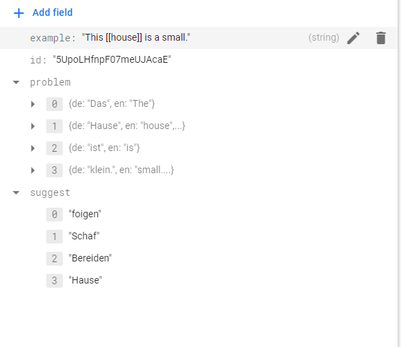

<p align="center">
  
</p>
This is the requirement for react native / typescript Test. [click here](https://docs.google.com/document/d/1DQKEIMsGhvBsWmZOVvWF2_2Zan5wpfH93F-X1oX7qcc/edit?usp=sharing)


<p align="center">
  
</p>
This is an example data stored on google firebase.

- 📱 **React Native** — version **0.64.0**
- 🎉 **TypeScript** - Type checking
- 📏 **ESLint** — Pluggable JavaScript linter
- 💖 **Prettier** - Opinionated Code Formatter
- 🌘 **Dark Mode** - Support dark mode
- 🌆 **UI Kit** - Beautiful UI
- ⚙️ **RN Dotenv** Environment variable with RN env

## 🚀 Getting started

Install node dependencies

```yarn
yarn install (or npm run install)
```

Install Dependencies for iOS

```
npx pod-install
```

# 🌼 Onboarding Screens

**Tech**

- React Native
- Typescript

**Navigation**

- React-Navigation 5.9+

**UI and Theme**

- @eva-design
- @ui-kitten/eva-icons
- react-native-responsive-screen

**Splash Screen**

- react-native-bootsplash

**Store**

- Redux
- Redux-Saga
- Redux-Toolkit
- Redux-Persist
- Async-Storage by Community

**Linting and Formating**

- Eslint
- Prettier
- EditorConfig

**Others**

- react-native-gesture-handler
- react-native-reanimated
- react-native-safe-area-context
- react-native-svg
- react-native-clean-project
- react-native-linear-gradient
- react-native-firebase

## 📝 License

This project is licensed under the MIT License - see the [LICENSE.md](LICENSE.md) file for more information.
